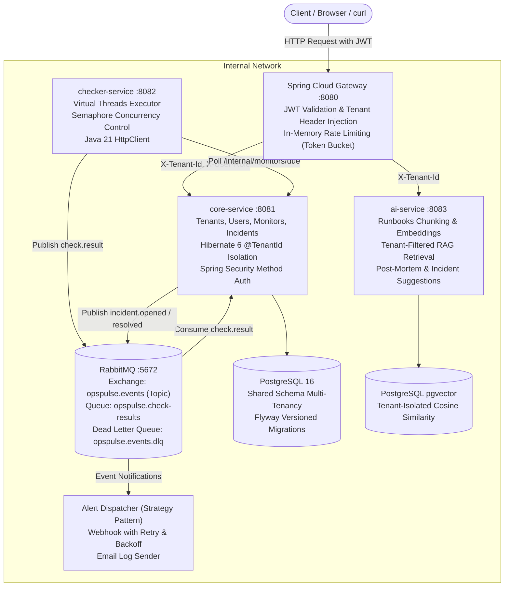

# OpsPulse

[](https://github.com/YashasviJadav03/OpsPulse/actions/workflows/ci.yml)
[](https://openjdk.org/projects/jdk/21/)
[](https://spring.io/projects/spring-boot)
[](https://github.com/pgvector/pgvector)
[](https://www.rabbitmq.com/)

**OpsPulse** is a cloud-native, multi-tenant uptime monitoring and incident management SaaS platform equipped with an AI on-call assistant. Designed with a microservices architecture in Java 21 and Spring Boot 3, OpsPulse delivers strict tenant data isolation, highly concurrent HTTP probing powered by Java Virtual Threads, reliable asynchronous messaging with RabbitMQ, and tenant-grounded Retrieval-Augmented Generation (RAG) using PostgreSQL `pgvector`.

---

## Architecture Overview



---

## Tech Stack

| Layer | Technologies |
|---|---|
| **Language & Runtime** | Java 21 (LTS), Virtual Threads (`Project Loom`), `HttpClient` |
| **Frameworks** | Spring Boot 3.3.4, Spring Cloud Gateway, Spring Data JPA, Spring Security, Spring AMQP |
| **Databases** | PostgreSQL 16 with `pgvector` extension, Flyway Database Migrations |
| **Messaging** | RabbitMQ 3.13 (Topic Exchange, Dead Letter Exchange & Queues) |
| **Security & Auth** | JJWT (HMAC-SHA256), BCrypt Password Hashing, Role-Based Access Control (`ADMIN`, `MEMBER`) |
| **Multi-Tenancy** | Shared Database & Shared Schema with Hibernate 6 `@TenantId` and `CurrentTenantIdentifierResolver` |
| **AI / RAG** | Markdown Chunker (~500 chars, 50 overlap), Vector Cosine Similarity Search, Prompt Templates, Mock LLM Client fallback |
| **Observability** | Spring Boot Actuator, Micrometer Prometheus metrics, MDC Structured Logging (`requestId`, `tenantId`) |
| **Testing & CI/CD** | JUnit 5, Mockito, Testcontainers, MockWebServer, JaCoCo, GitHub Actions |
| **Deployment** | Docker multi-stage builds, Docker Compose |

---

## Repository Layout

```text
opspulse/
├── pom.xml                                   # Parent POM (Java 21, dependency management, JaCoCo)
├── common/                                   # Shared DTOs, TenantContext, TenantFilter, ApiError
├── gateway/                                  # Spring Cloud Gateway (JWT validation, header stripping, rate limiter)
├── core-service/                             # Tenants, users, monitors, incidents, alerts, check results
├── checker-service/                          # Scheduled concurrent HTTP checker (Virtual Threads + Semaphore)
├── ai-service/                               # Runbooks, pgvector RAG suggestions, incident post-mortems
├── docs/
│   └── design-decisions.md                   # In-depth architectural trade-offs & interview guide
├── scripts/
│   └── demo.sh                               # End-to-end interactive CLI demonstration
├── docker-compose.yml                        # Full stack orchestrator with healthchecks
└── .github/workflows/ci.yml                  # GitHub Actions pipeline
```

---

## Multi-Tenancy Security Model

OpsPulse implements a **Shared Database, Shared Schema** multi-tenancy model governed by four defense-in-depth layers:

1. **Gateway Boundary**:
   - Strips any incoming `X-Tenant-Id` or `X-User-Role` headers sent by external clients.
   - Decodes and verifies the signed JWT token.
   - Extracts the authenticated `tenant_id` and `role` claims, and appends trusted internal `X-Tenant-Id` and `X-User-Role` headers downstream.
2. **Web Filter & Context**:
   - `TenantFilter` populates `TenantContext` (`ThreadLocal<UUID>`) and passes the ID to SLF4J MDC for structured traceability.
   - Automatically cleans up `TenantContext.clear()` in a `finally` block to prevent thread contamination.
3. **ORM & Query Filtering**:
   - Entities declare Hibernate 6 `@TenantId`. Hibernate automatically applies `tenant_id = :currentTenant` to all `SELECT`, `UPDATE`, and `DELETE` queries at runtime.
4. **Vector Search Isolation**:
   - AI similarity searches strictly filter runbook chunks using `WHERE tenant_id = :tenantId`, guaranteeing zero cross-tenant vector leakage.

---

## Quickstart (Run with Docker Compose)

Start the entire microservices ecosystem with a single command:

```bash
docker compose up --build -d
```

### Healthcheck Status

Once running, verify all services are healthy:

```bash
docker compose ps
```

Services exposed:
- **API Gateway**: `http://localhost:8080`
- **Core Service**: `http://localhost:8081`
- **Checker Service**: `http://localhost:8082`
- **AI Service**: `http://localhost:8083`
- **RabbitMQ Management**: `http://localhost:15672` (guest / guest)
- **PostgreSQL**: `localhost:5432` (opspulse / opspulse)

---

## API Summary Table

All application endpoints are accessed through the **API Gateway** (`http://localhost:8080`).

### Authentication (`/auth/**` - Public)
| Method | Path | Description | Access |
|---|---|---|---|
| `POST` | `/auth/register-tenant` | Creates tenant organization and primary `ADMIN` user | Public |
| `POST` | `/auth/login` | Authenticates user; returns signed JWT token | Public |

### Monitors (`/api/monitors/**`)
| Method | Path | Description | Access |
|---|---|---|---|
| `POST` | `/api/monitors` | Create a monitor (validates URL & interval 30s-3600s) | Member / Admin |
| `GET` | `/api/monitors` | List all monitors belonging to current tenant | Member / Admin |
| `GET` | `/api/monitors/{id}` | Get monitor details | Member / Admin |
| `PUT` | `/api/monitors/{id}` | Update monitor configuration | Member / Admin |
| `DELETE` | `/api/monitors/{id}` | Delete monitor | **ADMIN only** |
| `GET` | `/api/monitors/{id}/stats` | 24h uptime %, average latency, p95 latency | Member / Admin |

### Users (`/api/users/**`)
| Method | Path | Description | Access |
|---|---|---|---|
| `POST` | `/api/users` | Create a `MEMBER` user within the same tenant | **ADMIN only** |

### Incidents (`/api/incidents/**`)
| Method | Path | Description | Access |
|---|---|---|---|
| `GET` | `/api/incidents` | List incidents (filter by `?status=OPEN`) | Member / Admin |
| `GET` | `/api/incidents/{id}` | Get incident details | Member / Admin |
| `POST` | `/api/incidents/{id}/acknowledge` | Mark incident as `ACKNOWLEDGED` | Member / Admin |

### Alert Channels (`/api/alert-channels/**`)
| Method | Path | Description | Access |
|---|---|---|---|
| `POST` | `/api/alert-channels` | Register `WEBHOOK` or `EMAIL_LOG` alert channel | **ADMIN only** |
| `GET` | `/api/alert-channels` | List configured alert channels | Member / Admin |
| `DELETE` | `/api/alert-channels/{id}` | Remove alert channel | **ADMIN only** |

### Public Status Page (`/public/**` - Public)
| Method | Path | Description | Access |
|---|---|---|---|
| `GET` | `/public/status/{tenantSlug}` | Public tenant status and uptime of public monitors | Public (No Auth) |

### AI Assistant & Runbooks (`/api/ai/**`)
| Method | Path | Description | Access |
|---|---|---|---|
| `POST` | `/api/ai/runbooks` | Ingest markdown runbook (chunks and embeds vectors) | Member / Admin |
| `GET` | `/api/ai/runbooks` | List uploaded runbooks for current tenant | Member / Admin |
| `DELETE` | `/api/ai/runbooks/{id}` | Delete runbook and corresponding chunks | **ADMIN only** |
| `POST` | `/api/ai/incidents/{id}/suggest` | RAG-grounded root cause hypothesis & runbook steps | Member / Admin |
| `POST` | `/api/ai/incidents/{id}/postmortem` | Draft post-mortem summary (timeline & actions) | Member / Admin |

---

## Demo Walkthrough (curl commands)

### 1. Register Tenant A & Login
```bash
# Register Tenant Acme Corp
curl -s -X POST http://localhost:8080/auth/register-tenant \
  -H "Content-Type: application/json" \
  -d '{"tenantName": "Acme Corp", "adminEmail": "admin@acme.com", "password": "Password123!"}'

# Login to receive JWT
TOKEN_A=$(curl -s -X POST http://localhost:8080/auth/login \
  -H "Content-Type: application/json" \
  -d '{"email": "admin@acme.com", "password": "Password123!"}' | jq -r '.token')

echo "Token A: $TOKEN_A"
```

### 2. Create a Monitor (Tenant A)
```bash
curl -s -X POST http://localhost:8080/api/monitors \
  -H "Authorization: Bearer $TOKEN_A" \
  -H "Content-Type: application/json" \
  -d '{
    "name": "Production API",
    "url": "https://httpbin.org/status/200",
    "method": "GET",
    "intervalSeconds": 60,
    "expectedStatus": 200,
    "isPublic": true
  }'
```

### 3. Verify Multi-Tenant Isolation
Register a second tenant (`Beta Inc`) and attempt to access Tenant A's monitors:
```bash
# Register Tenant B
curl -s -X POST http://localhost:8080/auth/register-tenant \
  -H "Content-Type: application/json" \
  -d '{"tenantName": "Beta Inc", "adminEmail": "admin@beta.com", "password": "Password123!"}'

TOKEN_B=$(curl -s -X POST http://localhost:8080/auth/login \
  -H "Content-Type: application/json" \
  -d '{"email": "admin@beta.com", "password": "Password123!"}' | jq -r '.token')

# List monitors for Tenant B (returns empty list: [])
curl -s -X GET http://localhost:8080/api/monitors \
  -H "Authorization: Bearer $TOKEN_B"
```

### 4. Upload a Runbook & Request AI Incident Suggestion
```bash
# Ingest Runbook for 504 Gateway Timeouts
curl -s -X POST http://localhost:8080/api/ai/runbooks \
  -H "Authorization: Bearer $TOKEN_A" \
  -H "Content-Type: application/json" \
  -d '{
    "title": "Database Connection Pool Exhaustion Runbook",
    "content": "When response codes show 504 Gateway Timeout or latency exceeds 5000ms, inspect HikariCP active connections. Scale connection pool min-idle to 20 and restart core service workers."
  }'

# Request AI incident remediation recommendation
curl -s -X POST http://localhost:8080/api/ai/incidents/<INCIDENT_ID>/suggest \
  -H "Authorization: Bearer $TOKEN_A"
```

---

## Testing & Quality Assurance

### Run Local Unit & Integration Tests

Execute the full suite of unit and integration tests across all modules:

```bash
# Maven Wrapper
./mvnw clean test

# Complete verification with JaCoCo coverage analysis
./mvnw clean verify
```

### JaCoCo Code Coverage
JaCoCo generates aggregated line and branch coverage reports under each module:
- `core-service/target/site/jacoco/index.html`
- `gateway/target/site/jacoco/index.html`
- `checker-service/target/site/jacoco/index.html`
- `ai-service/target/site/jacoco/index.html`

The build enforces a minimum 70% instruction and line coverage across core service layers.

---

## CI/CD Pipeline

The GitHub Actions workflow (`.github/workflows/ci.yml`) runs on every `push` and `pull_request` to `main`:
1. **Build & Test**: Set up Java 21, cache Maven repository, execute `mvn clean verify`, and generate JaCoCo reports.
2. **Docker Artifacts**: Validates multi-stage Docker builds for all 4 microservices.
3. **Smoke Test**: Spins up containers with `docker compose up -d`, awaits health checks, and verifies registration, login, and monitor creation.

---

## Design Decisions & Deep Dive

For detailed architectural justifications and interview discussion points, refer to:
- [docs/design-decisions.md](file:///d:/OpsPulse/docs/design-decisions.md)
  - *Trade-offs of Shared Schema vs Schema-per-Tenant*
  - *Multi-layer Tenant Isolation verification*
  - *Virtual Threads vs Reactive Concurrency in HTTP Checkers*
  - *RabbitMQ Exchange Topology, Idempotency & DLQ Strategy*
  - *RAG Chunking, Tenant Vector Isolation & Grounding Prompts*
  - *Production Roadmap (Kubernetes, Kafka, Redis, Postgres RLS)*